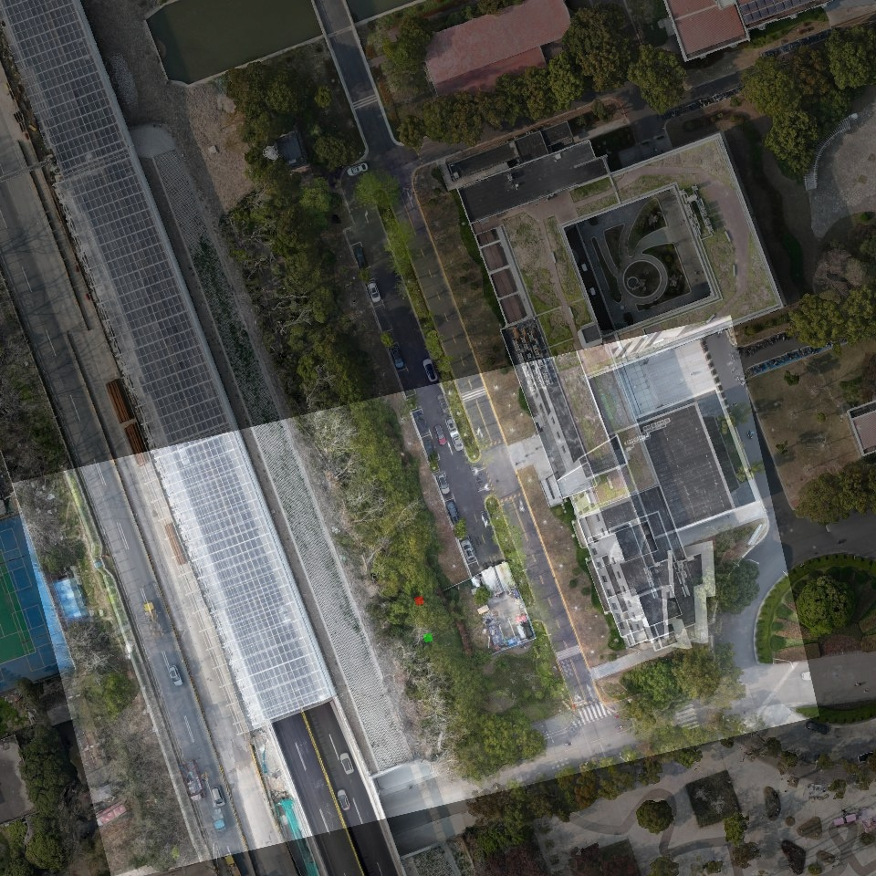
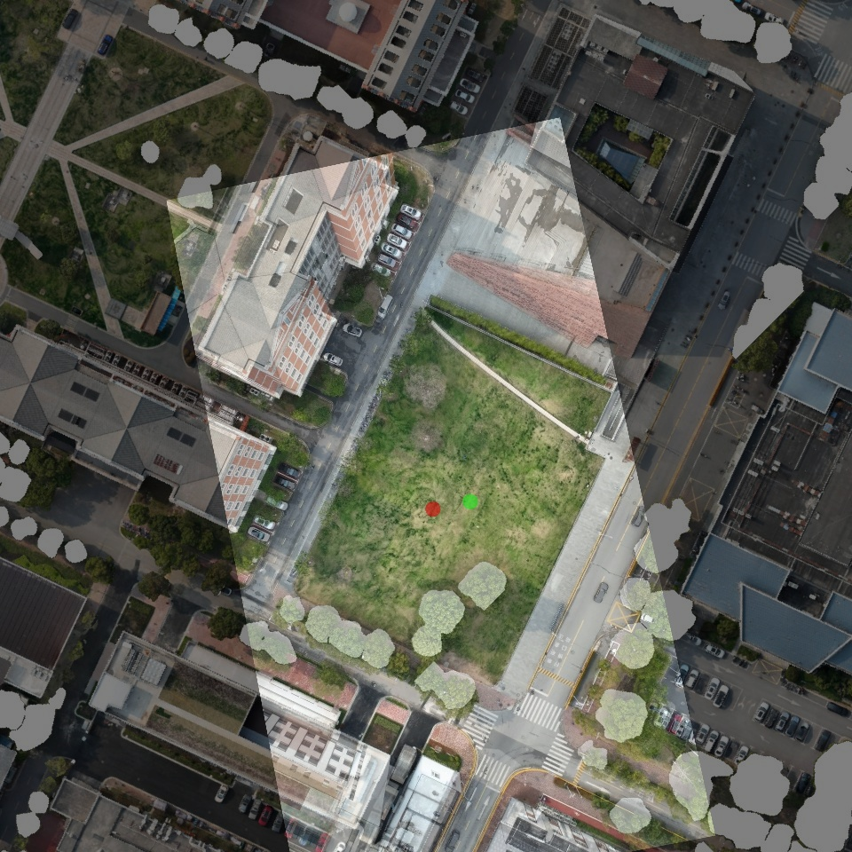

# Brief Introduction
This repo is a simple test in convert [GIM_ROMA](https://github.com/xuelunshen/gim) or [ROMA](https://github.com/Parskatt/RoMa) image matcher pytorch to tensorrt  

# Environment
python = 3.9  
onnx     
onnx-simplifier  
onnxruntime-gpu  
opencv  
torch  

# How to Use
## 1.pytorch 
1.1 get onnx model from the python file   
Watch out the path in extra.py file 
```bash
python extra.py
```
you can get the onnx-ori

1.2 simplify the onnx model
```bash
python onnxsimple.py
```
you can get onnx-sim

you can pass this step and download the onnx model in [onnx-ori](https://drive.google.com/drive/folders/1--WvnclFGsjRBd_2ByscYWTKNusOJnrx?usp=sharing) and [onnx-sim](https://drive.google.com/drive/folders/1DgLG-74HgarsDV1Inluuhodj6jF8hbdI?usp=sharing) directly.

1.3 test the onnx model
```bash
python testonnx.py
```

## 2.tensorrt
2.1 install tensorrt 
watch out do not use tensort 10.10.0(I got wired error),recommend tensorrt 10.8.0  
install tensorrt python package in tensorrt/python/

2.2convert onnx model to .engine file 
```bash
trtexec --onnx=/home/percy/workspace/roma_trt/onnx_ori/roma_core.onnx  --saveEngine=/home/percy/workspace/roma_trt/roma_core_ori.engine --minShapes=image_a:1x3x504x504,image_b:1x3x504x504  --optShapes=image_a:1x3x504x504,image_b:1x3x504x504  --maxShapes=image_a:1x3x504x504,image_b:1x3x504x504  --fp16 --verbose
```
you need to chang the path to yours  
similarily you can do this with the onnx_sim   
**note**:you need to remove the roma_core_ori_fp16.engine in this repo, .engine file must be made in your own machine  


2.3test the tensorrt with python  
now you get the .engine file   
```bash
python testtrt.py
```
2.4test the tensorrt with cpp
```bash
cd roma_cpp/build
./roma_app
```
**note**:you need to remove the roma_core_ori_fp16.engine in this repo, .engine file must be made in your own machine  


# Performance
tested on RTX4070(LAPTOP)
|  | time|
|:--:|:--:|
|pytorch|1.6s|
|tensorrt_py|0.16s|
|tensorrt_cpp|0.1s|





# Author
contact me if you have any questions.  

- Institution: Shanghai Jiao Tong University
- Email: [zhangpengcheng@sjtu.edu.cn](mailto:zhangpengcheng@sjtu.edu.cn)
- GitHub: [https://github.com/Percylevent](https://github.com/Percylevent)


